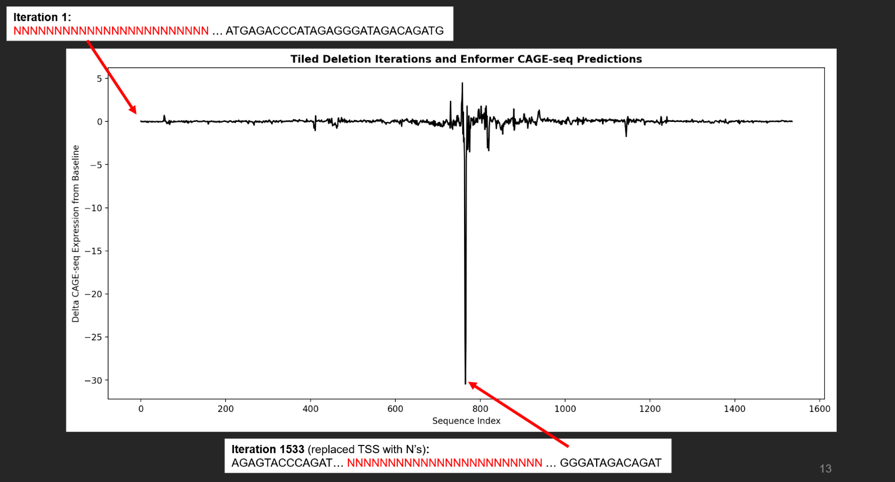
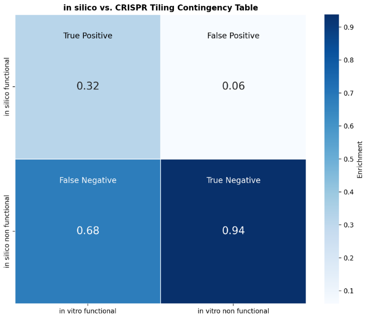

# _in silico_ Mutagenesis
Standard CRISPR Tiling Deletion screens are both expensive and time-intensive. Using the ML model Enformer benchmarked against a dataset of previously identified functional regions, a 7x enrichment in functional sequence identification was observed. Enformer was used to determine potential regulatory regions by sequential python string manipulation of the GATA3 locus, a gene involved in T-cell differentiation. The GATA3 sequence was centered along its transcription start site (TSS) with approximately 100Kb up and downstream. Enformer code was taken from the colab found [here](https://colab.research.google.com/github/deepmind/deepmind_research/blob/master/enformer/enformer-usage.ipynb#scrollTo=gM2KwV8gwMNj). Benchmark dataset found [here](https://www.cell.com/ajhg/fulltext/S0002-9297(23)00092-7?_returnURL=https%3A%2F%2Flinkinghub.elsevier.com%2Fretrieve%2Fpii%2FS0002929723000927%3Fshowall%3Dtrue). All perturbations, bootstrapping, statistical analyses, and modelling can be found in the attached notebook. 
  
Talk given at Salk 2024 SURF Capstone Presentation and can be watched [here](https://watch.salk.edu/media/t/1_u5yxkpgm/350492942).

Predicted CAGE-seq assay detection along GATA3 after ISM:
  

False Discovery Rate:

